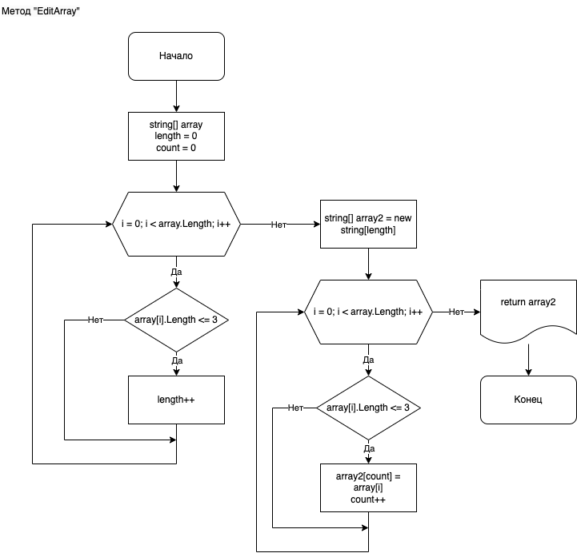

# Описание работы программы

## Краткое описание работы
Программа из имеющегося массива строк формирует массив из строк, длина которых *меньше либо равна 3 символа*.

**Например:**

Исходный массив | Новый массив
:---: | :---:
["hello", "2", "world", ":-)"] | ["2", ":-)"]
["1234", "1567", "-2", "computer science"] | ["-2"]
["Russia", "Denmark", "Kazan"] | []

>  Длина исходного массива задается пользователем в начале программы. Заполнение данного массива также производится пользователем. Затем на экран выводится исходный массив. Выполняются вычисления, создается новый массив. На экран выводится новый массив.

## Описание кода
Используются следующие функции (методы):

* ReadInt - метод, запрашивающий ввод данных с клавиатуры с соответствующим сообщением;
* CreateAndFillArray - метод, создающий и заполняющий массив данными, введенными пользователем;
   * Метод использует вышеупомянутый метод ReadInt;
* PrintArray - метод, выводящий содержимое массива в консоль;
* EditArray - метод, который формирует новый массив из переданного массива строк, с длиной каждой строки *менее либо равной 3 символа*.

_Основная содержательная часть программы выполняется в методе **EditArray**_. Данный метод будет рассмотрен подробнее.

### Метод EditArray

#### Блок-схема логики работы метода EditArray:



#### Исходный код метода EditArray:

```c#
string[] EditArray(string[] array)
{
    int length = 0;
    int count = 0;
    for (int i = 0; i < array.Length; i++)
        if (array[i].Length <= 3) length++;
    string[] array2 = new string[length];
    for (int i = 0; i < array.Length; i++)
    {
        if (array[i].Length <= 3)
        {
            array2[count] = array[i];
            count++;
        }
    }
    return array2;
}
```

## Публикация в сети

Данная программа расположена в репозитории на GitHub:

[Перейти на страницу проекта](https://github.com/Centurion195/ControlWork)